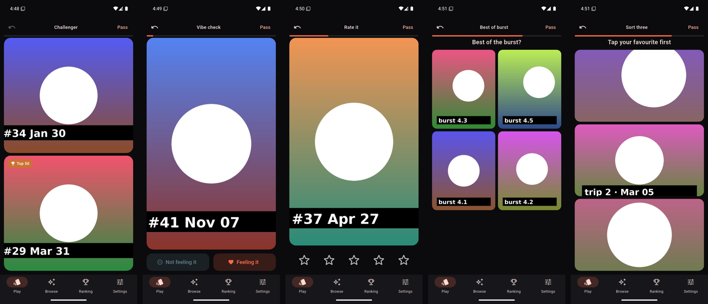
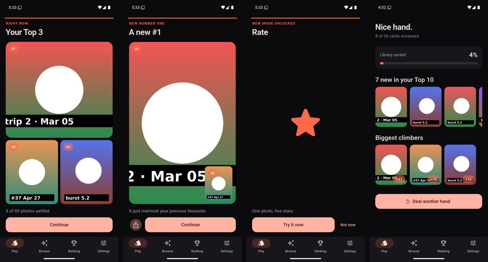
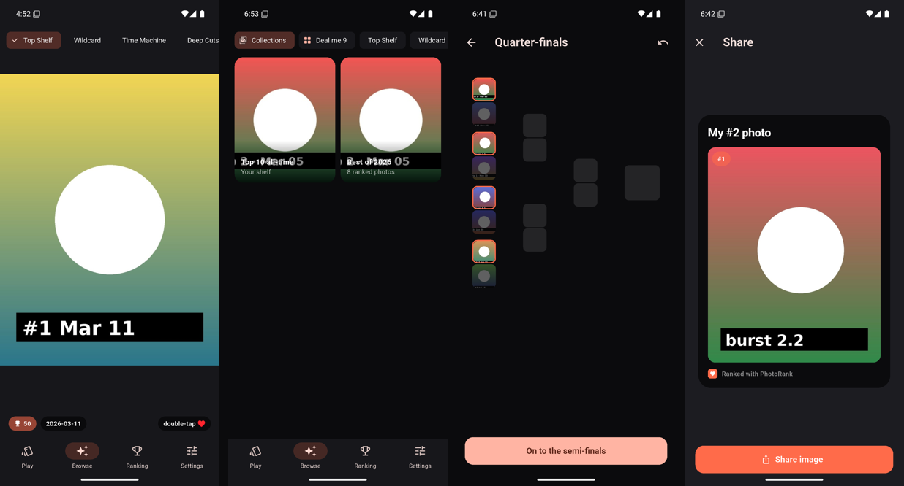

# PhotoRank

A tiny game that sorts your camera roll. Every swipe makes your favourites
clearer. Nothing is ever deleted, hidden, or uploaded — photos never leave the
phone; only ratings are stored.

## What it looks like

Six ways to decide — Duel / Challenger, Vibe check, Rate, Best of burst, Sort three:



Beats between cards keep it fresh — your Top 3, a new #1, a mode unlocking — and every hand ends in a reveal:



Browse your ranking as a Flow, auto-collections, a Top-16 bracket, and share cards:



*Captured on the Android emulator with generated placeholder images (see
`tool/make_seed_photos.py`); with a real library the cards are your photos.*

## How it works

- **Play** deals a hand of ~20 cards: Duel, Vibe check (feeling it / not
  feeling it), Rate (1–5★), Best of burst, Sort three, Challenger. Every answer
  becomes pairwise evidence for a Glicko-style rating (`lib/core/rating`).
- **The Dealer** (`lib/core/dealer`) picks photos by uncertainty, recency and
  neglect, pairs duels for maximum information, and always slips one top-tier
  photo into each hand.
- **Browse** is a vertical Flow through your ranking (Top Shelf, Wildcard,
  Time Machine, Deep Cuts) plus "Deal me 9". Double-tap ♥ is a light signal.
- **Ranking** is the grid output; **Settings** controls the game mix, hand
  size and library scope.
- **Recaps**: weekly / monthly / yearly ("your year") stories on the same page
  system, surfaced as the first card after a period ends; "Show my year" in
  Settings any time; opt-in weekly/daily reminders.
- **Bracket**: Top 16 single elimination from the Ranking menu, with a
  shareable bracket image. **Share cards**: Top 9 grid and "#1" card.
  **Favourites**: mark Top 10/50 as system favourites or export an album.
- **Widget**: "Today's Duel" on the home screen — tap a side to answer.
- **Progress**: levels, streaks and badges in the hand summary and Settings.
- **Axes**: rank the same library along several questions (Love is default;
  add Funny / Beautiful / Nostalgic / your own). Switch from the Ranking bar.
- **Pass the phone**: a friend plays ten cards on your settled photos —
  "Do we agree?" or "Do you know me?" — with an agreement score, the photos
  you disagree on, and a share card. Their answers never touch your ranking.
- **Arena** (opt-in, online): one photo a day, and it must have been taken
  that day. After entering you rate one set of other people's photos (up to
  10 duels) — only then does today's board open to you, so nobody sees the
  standings before contributing. Days close at 00:00 UTC; past boards are
  final and public. Private rooms by invite code, follow players for a
  Friends filter, report/block. "Your arena" shows every entry with where it
  finished, best days, streak and average percentile. Backed by Supabase
  (`supabase/`); see *Arena backend* below.
- **Notifications**: opt-in daily/weekly reminders, a daily "enter today's
  arena" nudge at a chosen hour (skipped on days you already entered), and
  server pushes when a day closes ("Your photo finished #12") via FCM — see
  `supabase/README.md`.
- **Beats** (`lib/core/beats`) keep play fresh: every 20–35 decisions a short
  in-play moment appears — your Top 3, a climber, a head-to-head to settle, a
  deep cut, a themed 10-card deck — plus majors on milestones, a new #1, the
  Top 10 settling, and mode unlocks (new installs start with Duel + Vibe check
  and unlock Rate/Burst/Sort/Challenger/Re-rank at 30/60/100/150/300
  decisions). Every beat is kept under Ranking → Moments and the big ones are
  shareable. Debug builds have "fire a beat" chips in Settings.

Design doc / roadmap: [`docs/ROADMAP.md`](docs/ROADMAP.md).

## Dev setup (Linux)

Flutter SDK lives in `~/development/flutter`, Android SDK in `~/Android/Sdk`
(both added to `~/.bashrc`). Open a new shell or:

```sh
export ANDROID_HOME="$HOME/Android/Sdk"
export PATH="$HOME/development/flutter/bin:$ANDROID_HOME/platform-tools:$PATH"
```

```sh
flutter doctor                 # Android toolchain should be ✓
flutter pub get
dart run build_runner build --delete-conflicting-outputs   # after editing lib/data/db/database.dart
flutter test                   # rating engine, dealer, sampler, repo tests
flutter analyze
```

## Run on your computer (Linux desktop)

Same app, folders instead of a camera roll. Needs the Linux toolchain
(`sudo apt install clang cmake ninja-build pkg-config libgtk-3-dev`).

```sh
tool/install_linux.sh                       # builds and adds PhotoRank to your app menu
PHOTORANK_FOLDER=~/Pictures ~/.local/opt/photorank/photorank   # first run: skip onboarding with a folder
```

Pick folders in onboarding or Settings → Library; photos are indexed
recursively with EXIF dates, thumbnails are cached under the app-support dir,
and nothing is moved or modified. Keyboard: ↑/↓ or 1/2 pick in a duel, ←/→
for vibe checks, 1–5 stars, 1–9 tiles in bursts and sorts, space = pass,
Z = undo. Share cards save to ~/Downloads. Windows/macOS are the same code
but need those machines to build.

## Run in the Android emulator

An AVD (`photorank`, API 35, Pixel 7) and a fake camera roll are one command
each — `tool/emulator.sh` wraps the details:

```sh
tool/emulator.sh create                       # once
tool/emulator.sh start                        # boots and waits for the device
python3 tool/make_seed_photos.py /tmp/seed    # 85 JPEGs with EXIF dates, bursts, trip days
tool/emulator.sh seed /tmp/seed               # push to DCIM/Camera + media rescan
tool/emulator.sh run                          # flutter run on the emulator
```

Note: Android's MediaProvider ignores EXIF `DateTimeOriginal` unless
`OffsetTimeOriginal` is also present (or the date is within a day of the file
mtime). The seed generator writes both; real camera JPEGs already do.

## Arena backend (local or cloud)

The whole backend runs on this machine with Docker: `sg docker -c "supabase start"`
in the repo applies `supabase/migrations/*` (Postgres, Auth, Storage, Studio
at http://127.0.0.1:54323). Then:

```sh
tool/arena_local.sh apk emulator   # build + install, pointed at http://10.0.2.2:54321
tool/arena_local.sh apk phone      # same, pointed at this PC's LAN IP (phone on the same Wi-Fi)
docker exec -i supabase_db_photorank psql -U postgres -d postgres -v ON_ERROR_STOP=1 < supabase/tests/arena_scenario.sql
```

The scenario prints `NOTICE: ok: …` for every rule (today-only photos, one
set unlocks the board, self-rating rejected, rooms, reports, day close,
result pushes). For real users point the same migrations at a Supabase cloud
project (`supabase db push`) — details, cron jobs and push setup in
[`supabase/README.md`](supabase/README.md).

## Run on an Android phone

1. Enable Developer options → USB debugging on the phone, plug it in, accept
   the RSA prompt.
2. `adb devices` should list it; then:

```sh
flutter run            # debug, hot reload
flutter run --release  # smooth animations, real performance
```

Or install the prebuilt debug APK: `flutter build apk --debug` →
`build/app/outputs/flutter-apk/app-debug.apk` (`adb install -r <apk>`).

## Release / Play Store

Release builds are signed with an upload key kept **outside** the repo
(`~/keys/photorank-upload.jks`, referenced from the git-ignored
`android/key.properties`). Back that keystore up — losing it means you can
never update the app on Play.

```sh
flutter build appbundle --release   # → build/app/outputs/bundle/release/app-release.aab (upload this to Play)
flutter build apk --release         # → build/app/outputs/flutter-apk/app-release.apk (sideload / GitHub release)
```

Store copy, data-safety answers, and the release checklist live in
[`docs/store/LISTING.md`](docs/store/LISTING.md); the privacy policy is
[`docs/PRIVACY.md`](docs/PRIVACY.md).

## Ideas on the roadmap

Not built yet — recorded here so they are not lost. Full staging in
[`docs/ROADMAP.md`](docs/ROADMAP.md).

- **A profile that shows your Top N.** Publish your top 10 (or any N) from
  your own library to a profile page friends can open — the mobile/desktop
  ranking finally has an audience, not just the one-photo-a-day Arena entry.
  Needs: per-photo opt-in before anything leaves the device, a "publish my
  top N" action that uploads only those photos (downsized, metadata
  stripped, exactly like an Arena entry), a way to unpublish, and a profile
  URL that works for someone without the app.
- **Rank your friends' top N.** Once friends publish their sets, those photos
  become a deck you can rank — and your friend sees the resulting order: how
  *other people* would sort their favourites. The rating engine already does
  this (it is the Arena's pairwise Glicko over a fixed pool); the new parts
  are a per-friend pool instead of a daily one, a "your friends ranked your
  top 10 like this" view for the owner, and per-set permissions (friends
  only / link / public).
- Open questions worth settling first: is a set ranked once or continuously;
  does the owner see who voted or only the aggregate; does ranking a friend's
  set feed your own library ranking at all (probably not — different question).

## Layout

```
lib/core/rating    glicko.dart, anchors.dart, observation.dart, engine.dart
lib/core/dealer    dealer.dart, priority.dart, burst_cluster.dart, photo_state.dart
lib/core/sampler   rank_sampler.dart (Browse channels)
lib/core/beats     beat.dart (pages/JSON), beat_scheduler.dart, beat_engine.dart, unlocks.dart, late_game.dart
lib/data/db        Drift schema (+ generated database.g.dart)
lib/data/repo      PhotoRepo, RankingRepo (applyCard / undoCard)
lib/data/media     LibraryScanner (photo_manager), ThumbCache
lib/core/bracket   single-elimination bracket model
lib/core/stats     levels and badges
lib/core/guest     pass-the-phone game and scoring
lib/data/arena     Arena API (Supabase + fake), models, upload preparation
supabase/          Arena schema, SQL Glicko, pairing, leaderboards, RLS
lib/features       play/, beats/, bracket/, browse/, guest/, arena/, share/, widget/, ranking/, settings/, onboarding/, shell/
android/app/src/main/kotlin/.../DuelWidgetProvider.kt   home-screen widget
```
